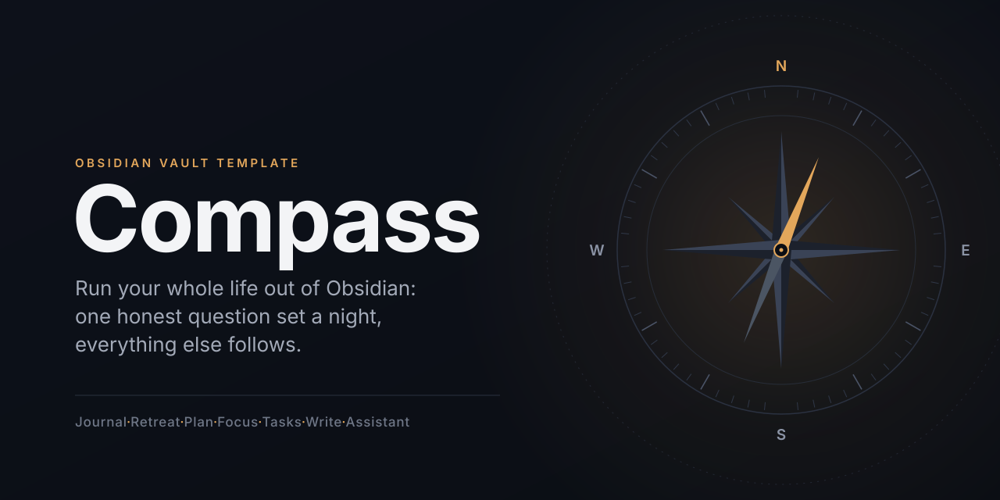

<p align="center"></p>
<!-- Fallback if the PNG is missing: <p align="center"></p> -->

# Life OS

*Run your whole life out of Obsidian: one honest question set a night, everything else follows.*

Compass is a complete Obsidian vault template of the system Mike Schmitz describes in "How I Run My Whole Life Out of Obsidian": journaling with daily questions, quarterly personal retreats, multi-scale planning, daily reading, task management, writing boards, and a DataviewJS dashboard that ties it together. The first-party Life OS application now sits above those workflows, with an AI assistant that reads `AGENTS.md` and runs a library of approval-aware prompts. Everything remains plain Markdown and properties. Ten community plugins and the first-party Life OS plugin ship inside the folder with their licenses.

**Status: development candidate, not a newly accepted public release.** The existing 1.0.2 archives predate the Life OS application. The next template candidate is 1.1.0, subject to packaging and native acceptance. Requires Obsidian 1.13.1 or newer. Core dashboard mobile compatibility needs native testing; Agent Client and the local API bridge are desktop-only.

## Watch the demo

[](https://www.youtube.com/watch?v=0mUx4z6M5AU)

**[Watch demo here](https://www.youtube.com/watch?v=0mUx4z6M5AU)**: a walkthrough of Compass by Daniel Agrici.

## Watch the idea

[](https://www.youtube.com/watch?v=-h7ZAuuNDLE)

Video by Mike Schmitz, Practical PKM (published 2026-06-26). Compass is an independent implementation of what the video describes. It is not affiliated with, endorsed by, or derived from Practical PKM, the LifeHQ vault, or the Obsidian Starter Vault, and contains none of their files or text. See `CREDITS.md`.

## Quick start

1. Download the zip from Releases, or clone this repository. The repository root is the vault.
2. Open the folder in Obsidian (Open folder as vault).
3. When Obsidian asks about Restricted mode, click **Turn off**. Then run the command **Reload app without saving** so the ten community plugins and Life OS light up. Life OS opens automatically after reload.
4. Open `00 Dashboards/Setup.md`. It checks itself and tells you what is left.
5. Tonight: Ctrl/Cmd+Shift+D opens today's note, Ctrl/Cmd+Shift+Q asks the questions. Answer 1 to 10, write one line under `## Journal`. Stop there. Everything else waits 30 days.

Notes tagged `example` are seed data so the dashboards render on first open; the Setup checklist reminds you to delete them.

## What is inside

```
00 Dashboards/   Setup, Compass Dashboard (focus mode), Daily Questions, Task, Projects, Library, Boards, Assistant
01 Journal/      Daily, Weekly, Quarterly periodic notes
02 Retreats/     YYYY-QN Personal Retreat notes (wheel of life in their properties)
03 Planning/     Life Theme, Core Values (+ roles), Ideal Week
04 Projects/     project notes (#project/<slug> tasks) and the Projects Board
05 People/       people notes (#p/<slug> tasks, #discuss roll-ups)
06 Writing/      Newsletters, YouTube Scripts, Articles, Course Content, each with a Kanban board
07 Library/      Course, Notes (quotes with block ids for embedding), Clippings
08 Tasks/        Tasks.md, the master list you capture to and never read
09 Reading/      Reading Plan, Chapters, Verses, Study Notes, Topics (Bible is the worked example)
Prompts/         16 prompts for your AI agent, one note per recurring job
Templates/       Templater templates; property lists come from Meta/Compass Config.md
Meta/            Compass Config.md (the single config), views/*.js (dashboard widgets), version.md
Guide/           principles, plugins, one page per workflow, build order, agents, MCP, prompt library
wiki/, inbox/    knowledge layer for the claude-obsidian plugin (optional; plain Markdown without it)
scripts/         reading plan generator, Bible splitter, template build and verify
  .github/         CI workflow (verify) and issue templates
CHANGELOG.md, CONTRIBUTING.md, SECURITY.md, CODE_OF_CONDUCT.md, CREDITS.md, LICENSE, LICENSE-GUIDE.md, THIRD_PARTY_NOTICES.md
.claude-obsidian.json  marker for the claude-obsidian knowledge layer
AGENTS.md        rules and folder map for any AI agent; CLAUDE.md and GEMINI.md point to it
.claude/         settings.json: read-only MCP tool allowlist for Claude Code (no secrets)
.mcp.example.json  how to point an agent at Obsidian's MCP server (Local REST API)
```

`Meta/Compass Config.md` is the single config: questions, life dimensions (wheel areas), folders, prefixes, birthdate. Dashboards discover `dq_*` and `wheel_*` properties by prefix, so changing the lists there changes the whole vault.

## The seven workflows

| # | Workflow | Where it lives | Guide |
| --- | --- | --- | --- |
| 1 | Journaling with Daily Questions | `01 Journal/Daily`, `Templates/Daily Note.md`, `Templates/Daily Questions Prompt.md`, questions in `Meta/Compass Config.md` | `Guide/03 Workflow - Journaling and Daily Questions.md` |
| 2 | Quarterly personal retreat | `02 Retreats`, `Templates/Personal Retreat.md` | `Guide/04 Workflow - Personal Retreat.md` |
| 3 | Multi-scale planning | `01 Journal/{Daily,Weekly,Quarterly}`, `03 Planning` | `Guide/05 Workflow - Multi-Scale Planning.md` |
| 4 | ICOR: highlight of the day, project health, life dimensions, library | `highlight_of_the_day` in the daily note, Compass, Projects, and Library dashboards, `07 Library/{Course,Notes,Clippings}` | `Guide/06 Workflow - ICOR, Focus, and Library.md` |
| 5 | Daily reading (Bible as the worked example) | `09 Reading` | `Guide/07 Workflow - Daily Reading.md` |
| 6 | Task management | `08 Tasks/Tasks.md`, `04 Projects`, `05 People`, `00 Dashboards/Task Dashboard.md` | `Guide/08 Workflow - Task Management.md` |
| 7 | Writing | `06 Writing/*` with Kanban boards | `Guide/09 Workflow - Writing.md` |

Layered on top: the Compass dashboard (`Guide/10`), Kanban boards (`Guide/13`), AI in the vault (`Guide/14`, `Guide/20`), the claude-obsidian knowledge layer (`Guide/15`), research and publishing with Web viewer, SEO, and Vault Lens (`Guide/16`, `Guide/17`), and the Obsidian MCP bridge (`Guide/19`). Start with `Guide/00 Start Here.md`.

The layering rule: pick one workflow, probably the daily journaling, get it working for 30 days, then layer the next one. `Setup.md` enforces that order.

## Plugins included

All ten community plugins are bundled under `.obsidian/plugins/`, each with a recorded version and license, and are listed as enabled. Byte-for-byte upstream provenance is a separate release check. The first-party `life-os-app` plugin is installed alongside them. Details and the first-open checklist are in `Guide/02 Plugins.md`.

| Plugin | Id | Version | License |
| --- | --- | --- | --- |
| Dataview | `dataview` | 0.5.68 | MIT |
| Templater | `templater-obsidian` | 2.25.0 | AGPL-3.0 |
| Periodic Notes | `periodic-notes` | 0.0.17 | MIT |
| QuickAdd | `quickadd` | 2.23.0 | MIT |
| Tasks | `obsidian-tasks-plugin` | 8.4.0 | MIT |
| Kanban | `obsidian-kanban` | 2.0.51 | GPL-3.0 |
| Omnisearch | `omnisearch` | 1.30.1 | GPL-3.0 |
| Local REST API | `obsidian-local-rest-api` | 5.1.0 | MIT |
| Agent Client | `agent-client` | 0.12.1 | Apache-2.0 |
| SEO | `seo` | 0.5.6 | MIT |

The first-party Life OS application (`life-os-app`) is separately versioned and licensed under MIT. It is the native navigation, capture, and live-dashboard layer. See `Guide/21 Life OS Application.md`.

Upstream repositories and release tags are in `THIRD_PARTY_NOTICES.md`. Obsidian itself is not included.

## AI agents in the vault

- `AGENTS.md` is the canonical instruction file for any agent: folder map, property conventions, safety rules (read before write, ask before edit, never rewrite journal or planning text). `CLAUDE.md` and `GEMINI.md` point to it.
- `Prompts/` holds 16 recurring jobs, one note per job (morning start, end of day coaching, weekly review, retreat prep and facilitation, task triage, meeting prep, project kickoff, board grooming, writing pipeline, SEO audit, research capture, trend analysis, what matters today, vault health check, onboarding). Each note carries its own `risk` level and a button; see `Guide/20 Prompt Library.md`.
- Agent Client (`agent-client`) runs a local agent (Claude Code, Codex, Gemini CLI, and others) over the Agent Client Protocol and puts the chat in the sidebar or inside a note. Every edit is shown as a diff and needs approval; auto-allow ships off. See `Guide/14 Agent Client and Claude Code.md`.
- The Obsidian MCP bridge: Local REST API 5.x serves an MCP server at `http://127.0.0.1:27123/mcp` (16 tools: open notes, run commands, search, read, patch). `.mcp.example.json` shows the client config; `.claude/settings.json` pre-approves the read-only tools for Claude Code. See `Guide/19 Obsidian MCP Bridge.md`.
- No keys ship. Local REST API generates a per-install key on first load; each member registers the server in their own agent (for Claude Code, `claude mcp add --scope user ...`) with that key kept outside the vault. `.mcp.json`, agent sessions, and exported chats are excluded by `.gitignore` and by the build.

## Build and release


The template is built from the maintainer's live vault, never edited in the built copy:

```bash
python3 scripts/verify_release_safety.py
python3 scripts/build_template.py --out ../life-os-releases --name LifeOS-1.1.0-candidate --version 1.1.0 --zip
python3 scripts/verify_template.py ../life-os-releases/LifeOS-1.1.0-candidate
```

`build_template.py` copies with drop rules, keeps only `example`-tagged notes in user folders, resets defaults, strips machine state from plugin settings, adds the version and a one-page workspace, then verifies and zips. `verify_template.py` exits 1 on any failure: forbidden strings (names, paths, keys, certificates, em dashes), plugin settings (Local REST API exactly `{"enableInsecureServer": true}`, Agent Client with no sessions and auto-allow off, Omnisearch HTTP server off, QuickAdd online features off), plugin folders with LICENSE, notices matching manifests, referenced paths and wikilinks resolving, `Meta/views/*.js` syntax under Node, and total size under 20 MB. The `verify` workflow runs it on every push and pull request. Maintainer checklist: `scripts/RELEASE.md`. Changes: `CHANGELOG.md`.

There is no transactional in-place upgrader. Back up the complete vault, extract a new release beside it, and migrate personal content, custom configuration, and templates with conflict review. Do not replace the working `.obsidian` folder wholesale. A backup is not proven until a restore has been tested. See `scripts/RELEASE.md` and `Guide/23 Native Acceptance.md`.

## Credits and license

Workflows follow Mike Schmitz's public video (Practical PKM). Daily questions: Marshall Goldsmith and Mark Reiter, *Triggers* (2015). Multi-scale planning: Cal Newport. Full credits in `CREDITS.md`.

Code, templates, dashboards, scripts, and configuration are MIT (`LICENSE`). The prose in `Guide/` is CC BY 4.0 (`LICENSE-GUIDE.md`). Third-party plugin binaries under `.obsidian/plugins/` keep their own licenses; see `THIRD_PARTY_NOTICES.md`. Community rules: `CODE_OF_CONDUCT.md`.

Contributing: `CONTRIBUTING.md`. Security: `SECURITY.md`.
